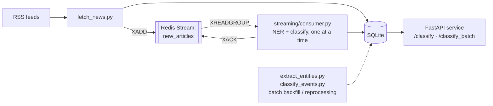

# Financial News Event Intelligence Engine

A pipeline that ingests financial news in near real time, extracts the
companies/tickers involved, classifies the type of market-moving event,
and serves predictions over HTTP with measured (not assumed) latency.

Built as a learning project to go deep on the intersection of NLP,
real-time systems, and the specific engineering discipline financial ML
demands: every optimization here was checked against correctness before
being kept, not just benchmarked for speed.

## Highlights

- **Caught a silent correctness regression before shipping it.** INT8
  dynamic quantization looked like a clean ~2x latency win on paper -
  direct comparison against a known-answer headline showed it was
  actually flipping confident, correct predictions into near-random
  noise. Reverted, documented, moved on. ([details](#m4a--latency-optimization))
- **Verified a distributed-systems failure mode, not just claimed
  resilience.** Killed a Redis Streams consumer mid-message on purpose,
  confirmed the work was stuck via `XPENDING`, then watched a fresh
  consumer's `XAUTOCLAIM` reclaim and finish it automatically.
  ([details](#m5--streaming-layer-redis-streams))
- **Measured the real latency/throughput tradeoff instead of guessing at
  it.** A single HTTP request to `/classify` costs ~6s (p50); batching
  the same work brings per-article cost to ~1-4s depending on batch
  size. Which one matters depends on how "real-time" gets defined for
  the actual product, and that tradeoff is written up, not hand-waved.
- **14 fast, deterministic unit tests** covering the parts of the system
  that don't require an ML model to verify (ticker resolution, DB dedup,
  entity filtering) - see [Testing](#testing).

## Architecture



Two processing paths exist on purpose: the **stream consumer** handles
new articles as they arrive, one at a time, optimized for low per-item
latency. The **batch scripts** exist for backfilling history or
reprocessing after a bug fix (e.g. the M4a quantization revert), and are
optimized for throughput via batching instead. Same NER/classification
logic underneath either way (`src/nlp/`).

## Quickstart

```bash
python -m venv .venv
source .venv/bin/activate
pip install torch --index-url https://download.pytorch.org/whl/cpu  # CPU build; skip default index or it pulls the CUDA build (multi-GB)
pip install -r requirements.txt
python -m spacy download en_core_web_sm
python -m src.reference.fetch_sp500   # one-time: builds the ticker lookup table
```

**Option A — streaming (real-time path):**
```bash
# needs redis-server running locally
python -m src.ingest.fetch_news             # producer: fetches news, publishes new article ids
python -m src.streaming.consumer worker-1   # consumer: NER + classification, one article at a time
```

**Option B — batch (backfill/reprocessing path):**
```bash
python -m src.ingest.fetch_news
python -m src.nlp.extract_entities
python -m src.nlp.classify_events
```

**Serve predictions over HTTP:**
```bash
uvicorn src.api.main:app --reload
# open http://localhost:8000/docs for the interactive Swagger UI
```

## Testing

```bash
python -m pytest tests/ -v
```

14 tests, ~7 seconds, no ML inference involved on purpose - they cover
`company_lookup` (ticker resolution, including a regression test for a
real case-sensitivity bug found while writing these), `db` (dedup,
migrations, unprocessed/unclassified queries), and `extract_entities`
(the ORG-filtering logic, tested against a mocked spaCy output rather
than the real model, since asserting on a specific model's exact NER
output would make the test suite fragile to model/version upgrades).
Classifier correctness itself is checked via the manual fp32-vs-quantized
comparison described below, not an automated test - that's a fair gap to
flag, not something to pretend is covered.

## Roadmap

- [x] M0 — repo scaffold
- [x] M1 — RSS news ingestion → SQLite
- [x] M2 — NER (companies/tickers)
- [x] M3 — event classification (zero-shot baseline)
- [x] M4a — latency optimization (quantization attempt, reverted; batching kept)
- [x] M4b — FastAPI serving layer + request-level p50/p99 benchmarks
- [x] M5 — streaming layer (Redis Streams)
- [x] M6 — portfolio polish (tests, README, this list)
- [ ] M3b — fine-tune on labeled data (if zero-shot proves insufficient)

## Engineering notes

The rest of this README is the actual build log - what was tried, what
broke, what got measured, and why decisions were made. Kept intentionally
unpolished/chronological rather than rewritten as if everything worked
first try, because the failures and the reasoning around them are the
part worth showing in an interview.

### M2 — NER limitations

- Ticker resolution is scoped to S&P 500 constituents only — foreign/small-cap
  names (e.g. BYD, CATL) correctly return no ticker rather than a wrong one.
- `en_core_web_sm` occasionally misdraws entity boundaries on headline-style
  text (e.g. absorbing trailing words like "Stock Underperforming"). A
  length-based filter mitigates the worst cases (see `test_extract_entities.py`
  for the regression test).
- Matching raw ticker symbols directly (e.g. "AMD") introduces an
  irreducible ambiguity: an all-caps word that happens to also be a valid
  ticker (e.g. "COO", the job title) will still resolve as that ticker.
  Case-sensitivity was tightened during M6 test-writing (lowercase/mixed-case
  lookalikes no longer match - that part *was* a bug, now fixed and
  regression-tested), but the all-caps case is a genuine, accepted
  limitation, not a bug: there's no way to distinguish "COO" the acronym
  from "COO" the ticker without more context than a single token gives you.

### M3 — event classification limitations

- ~40% of articles land in "other" — a lot of feed content (general macro
  explainers, policy news unrelated to a specific company) doesn't fit the
  event taxonomy at all, which is expected, not a bug.
- Confidence scores look informative on a quick eyeball (high-confidence
  picks are qualitatively correct, e.g. leadership changes; low-confidence
  picks are genuinely ambiguous headlines) but haven't been validated
  against real labels yet — that's what a hand-labeled eval set would give
  us, which ties into Project 2's calibration work later.

### M4a — latency optimization

Diagnosis first: zero-shot NLI classification runs one forward pass *per
candidate label* (it's testing "does this text entail label X" for each
label separately), so cost scales with the number of labels, not O(1) per
article. With 10 labels that's a real multiplier, and it's the main reason
the M3 baseline was slow - not model size alone.

Benchmarked four configs on a fixed sample of real articles
(`python -m src.nlp.benchmark_classifier --mode <name>`):

| Config              | Per-article latency | vs. baseline |
|---------------------|---------------------|---------------|
| baseline (fp32)      | ~10.2s mean         | 1x            |
| batched only         | ~7.5s               | ~1.4x         |
| quantized only       | ~4.8s mean          | looked ~2.1x, see below |
| quantized + batched  | ~3.75s              | looked ~2.7x, see below |

**Quantization was reverted after a correctness check caught a real
regression.** `torch.quantization.quantize_dynamic` (INT8 on Linear
layers) looked like the bigger win on latency alone, but before shipping
it I ran a direct fp32-vs-quantized comparison on a known headline
("Warren Buffett steps down..."):

```
fp32:      leadership change            0.833
quantized: analyst rating or price target  0.137
```

Wrong label, confidence collapsed to near-random. Dynamic INT8
quantization apparently doesn't tolerate this BART-based encoder-decoder
model well (unlike plain BERT/DistilBERT encoders, where it's usually
safe) - likely the cross-attention layers are more precision-sensitive.
A batch of 48 articles classified with the quantized model before this
was caught confirmed it: average confidence 0.167 vs. 0.426 for
everything classified with fp32 - a clear sign of degenerate output, not
just "harder headlines." Those 48 rows were reset and reclassified with
fp32.

**Lesson kept for the interview, not just the README:** a latency win
that isn't checked against a correctness baseline isn't a win, it's a
liability, and this project is explicitly about a domain (financial
predictions) where that trade only goes one way. `classify_events.py`
now runs fp32 + batching only (`batch_size=8`), which is the safe,
verified part of the speedup.

On the full 48-article production batch, fp32 + batching landed at
**~1.1s/article** - notably better than the 4-article benchmark's 7.5s,
because batching benefits scale with batch size, and real pipelines
process articles in bulk anyway, not one at a time.

Caveats:
- Numbers were measured on a memory-constrained dev laptop under
  sustained load earlier in the session - some runs likely saw CPU
  thermal throttling. Production latency numbers need dedicated hardware.
- Still not real-time (sub-second per article in the worst case). Future
  options: fewer candidate labels, a smaller distilled model, ONNX
  export (which has more mature quantization support for seq2seq models
  than raw PyTorch dynamic quantization), or a fine-tuned single-pass
  classifier (M3b) that doesn't pay the per-label NLI cost at all.

### M4b — FastAPI serving layer

Wrapped the classifier in an actual HTTP service (`src/api/main.py`) with
three endpoints: `GET /health`, `POST /classify` (one article), and
`POST /classify_batch` (many articles, one forward pass per label across
the whole batch). The model loads once at app startup via FastAPI's
`lifespan` context manager, not per-request — reloading a ~1.3GB model on
every call is the single most common way to accidentally 100x your
latency, and startup-time loading is the actual fix, not a detail.

Ran the server locally and hit it with a real client
(`src/api/benchmark_api.py`, using `httpx`) over actual HTTP, not just
in-process function calls - this measures what a real caller would see,
request/response serialization included:

| Endpoint              | Result (n=10)                          |
|------------------------|-----------------------------------------|
| `/classify` (single)   | mean 6.05s, p50 6.17s, p99 7.54s        |
| `/classify_batch`      | 4.00s/article avg                       |

Single-request latency is worse here than the earlier batch-script
numbers (~1.1-2.4s/article) because a single `/classify` call gets none
of the batching benefit - it's one article, one full pass over all 10
labels, no amortization possible. This is the honest, expected shape of
the latency/throughput tradeoff: a system taking one article at a time
as it arrives pays the full per-item cost; a system that can buffer and
batch pays much less per item but adds a few seconds of queuing delay.
Which one you want depends on the actual product requirement (is
"real-time" defined as "under 100ms for one article" or "under 1s
average across a stream of them?") - that's a question for M5, not
something to guess at here.

### M5 — streaming layer (Redis Streams)

Until now, `fetch_news.py` wrote to SQLite and `extract_entities.py` /
`classify_events.py` separately polled it for unprocessed rows - a
workable batch pipeline, but not how a "real-time event intelligence"
system should be shaped. M5 decouples ingestion from processing with a
Redis Stream sitting between them:

- **Producer** (`fetch_news.py`): after inserting a genuinely new
  article, `XADD`s its id to the `new_articles` stream.
- **Consumer** (`src/streaming/consumer.py`): a worker in a consumer
  group (`processors`) that `XREADGROUP`s one message at a time, runs
  NER + classification on it, writes results, then `XACK`s. One at a
  time deliberately - a stream consumer's job is low latency per item as
  things arrive, not throughput (that's what the batch scripts and
  `/classify_batch` are for; see the M4b tradeoff writeup above).

The actual reason to use a durable stream instead of just polling the
DB: **a crashed worker doesn't lose work.** Verified this directly
rather than just asserting it:

1. Had a consumer (`crashed-worker`) `XREADGROUP` a message, then exit
   without acking - simulating a crash mid-processing.
2. Confirmed via `XPENDING` the message was stuck, owned by the dead
   consumer, idle and undelivered.
3. Waited past the 30s idle threshold, then ran a real consumer
   (`worker-2`). Its `reclaim_stale()` step (`XAUTOCLAIM`) picked up the
   abandoned message automatically, processed it, and acked it -
   `XPENDING` went back to 0 and the article got correctly classified.

This is exactly the failure mode a poll-the-database design can't handle
cleanly without a lot of bespoke locking/retry logic, and it's the kind
of reliability property the JD's "data integrity" language is pointing
at, not just "does the model work on the happy path."

Known limitations:
- `XACK` removes a message from the pending list, not from the stream
  itself - `XLEN` keeps growing forever unless trimmed. A real deployment
  needs `XTRIM` (by `MAXLEN` or age) on a schedule; not implemented here.
- Ingestion (`fetch_news.py`) now has a hard dependency on Redis being
  up - if Redis is down, ingestion fails outright rather than degrading
  gracefully. A more decoupled design would have ingestion always write
  to SQLite and a separate lightweight tailer publish to the stream, so
  ingestion never depends on Redis's uptime. Traded that complexity away
  here; worth naming as a deliberate simplification, not an oversight.
- Single consumer process demoed. The consumer-group design means
  running multiple `worker-N` processes would load-balance the stream
  across them for free (that's what consumer groups are for), but this
  wasn't load-tested with more than one.
